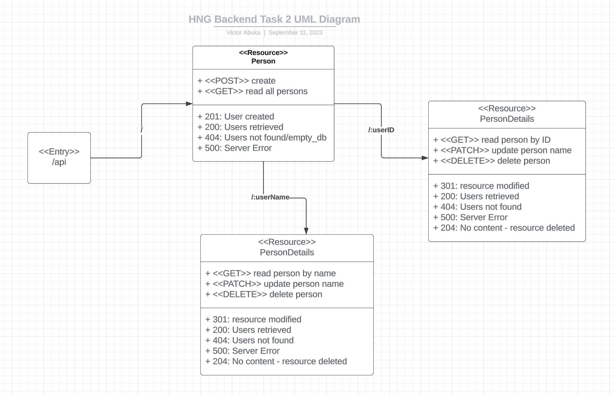
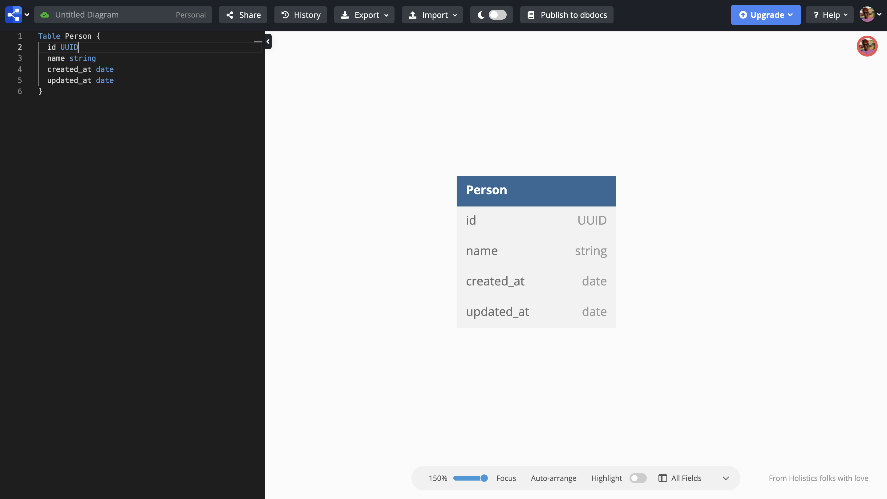

# HNGx Backend Task 2

This is a simple CRUD (Create, Read, Update, Delete) API built using Node.js, Express, and MongoDB. It provides basic functionality to manage resources and serves as a template for building more complex APIs. Below, you will find instructions on setting up and running the project.

## Live link to the API

[https://backend-task1-g9t6.onrender.com](https://backend-task1-g9t6.onrender.com)

```
https://backend-task1-g9t6.onrender.com
```

## Prerequisites

Before you get started, make sure you have the following installed on your system:

- [Node.js](https://nodejs.org/) (version 14 or higher)
- [MongoDB](https://www.mongodb.com/) (Make sure MongoDB is up and running on your system)
- [Compass](https://www.mongodb.com/docs/compass/master/install/) (This is optional)

## Getting Started

1. Clone the repository to your local machine:

```bash
git clone https://github.com/Abuka-Victor/hngx-backend.git
cd hngx-backend
```

2. Install project dependencies:

```bash
npm install
```

3. Create a `.env` file in the root of the project directory with the following content:

```env
# MongoDB URI
MONGO_URI=your_mongodb_uri_here
# PORT
PORT=your_port_here
```

Replace `your_mongodb_uri_here` with the URI to your MongoDB instance. You can obtain this URI from your MongoDB hosting service or use a locally hosted MongoDB instance.

## API UML Diagram



## API ER Diagram



## Running the API

Now that you've set up the project and configured the environment variables, you can start the API server:

```bash
npm run dev
```

The API will run on `http://localhost:3000` by default. You can change the port by modifying the `PORT` variable in the `.env` file.

## API Endpoints

This API provides the following CRUD endpoints for managing resources:

- **Create**: `POST /api/`
- **Read (All)**: `GET /api/`
- **Read (One)**: `GET /api/:id`
- **Read (One)**: `GET /api/:username`
- **Update**: `PATCH /api/:id`
- **Update**: `PATCH /api/:username`
- **Delete**: `DELETE /api/:id`
- **Delete**: `DELETE /api/:username`

You can test these endpoints using tools like [Postman](https://www.postman.com/) or [curl](https://curl.se/).

> Please see the documentation on [here](https://documenter.getpostman.com/view/17358662/2s9YC2zDDq) for more information. You should have setup the project locally before trying this out. Make sure to change the port in Postman if necesary.

## Example Usage

Here's an example of how to use the API endpoints:

### Create a Person

```http
POST /api/
Content-Type: application/json

{
  "name": "Victor",
  "description": "This is a new person."
}
```

### Read All Persons

```http
GET /api/
```

### Read a Specific Person

```http
GET /api/:id
```

Replace `:id` with the ID of the person you want to retrieve.

```http
GET /api/:username
```

Replace `:username` with the username of the person you want to retrieve.

### Update a Person

```http
PATCH /api/:id
Content-Type: application/json

{
  "name": "Bello",
  "description": "This Person has been updated."
}
```

Replace `:id` with the username of the person you want to update.

```http
PATCH /api/:username
Content-Type: application/json

{
  "name": "Bello",
  "description": "This Person has been updated."
}
```

Replace `:username` with the username of the person you want to update.

### Delete a Resource

```http
DELETE /api/:id
```

Replace `:id` with the ID of the person you want to delete.

```http
DELETE /api/:username
```

Replace `:username` with the username of the person you want to delete.

### Testing the API with the Bash Script

To test the API with the Bash Script simply run the following command

```bash
./test.sh prod #to test the live API
```

```bash
./test.sh dev 3000 #to test the local API on port 3000
```

```bash
./test.sh help #to view the testing documentation
```

> If you want to run the test script on windows and it doesn't work properly you can check [here](https://www.thewindowsclub.com/how-to-run-sh-or-shell-script-file-in-windows-10) for how to run the script

## Conclusion

You now have a basic understanding of how to set up and use this simple CRUD API.
